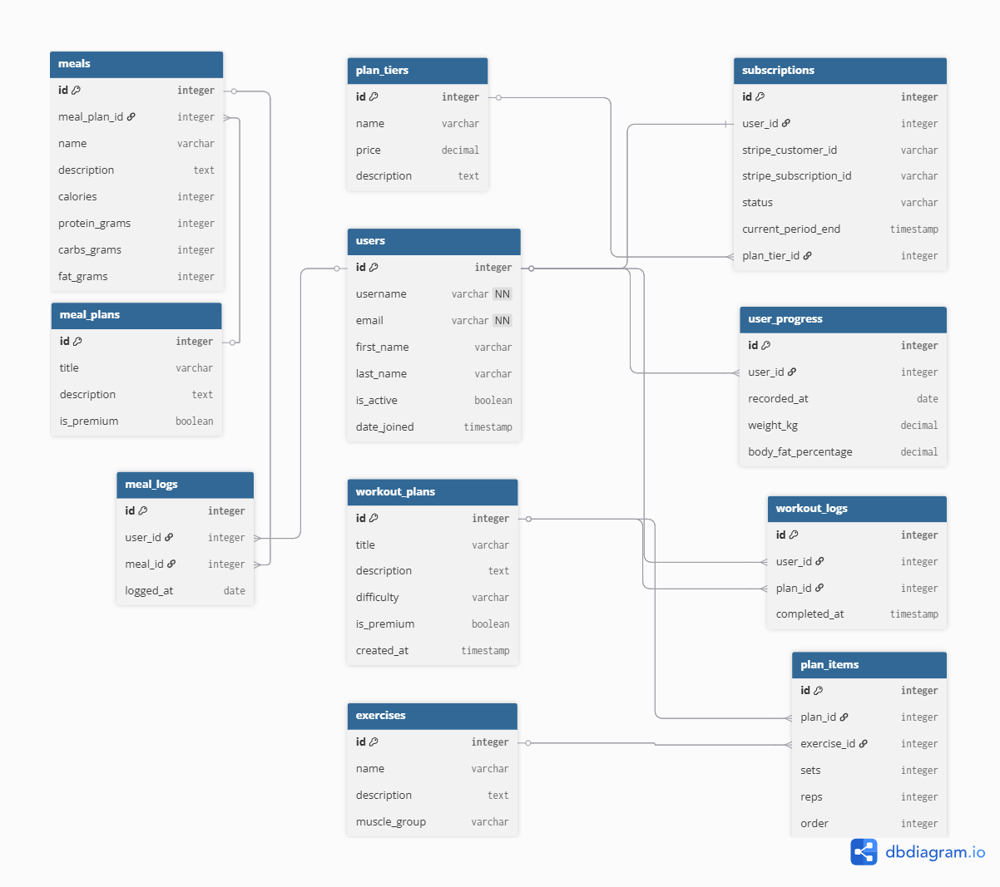

# FitTrack Pro – Premium Fitness Planner

**FitTrack Pro** is a comprehensive full-stack web application designed for fitness enthusiasts who want a professional, data-driven approach to their workout and meal planning. 

***

## Table of Contents
1. [**Project Overview**](#1-project-overview)
2. [**UX & Design**](#2-ux--design)
    * [2.1 Design Process](#21-design-process)
    * [2.2 Wireframes](#22-wireframes)
3. [**Features (User Stories)**](#3-features-user-stories)
    * [3.1 New User (Visitor)](#31-new-user-visitor)
    * [3.2 Registered User (Non-Subscriber)](#32-registered-user-non-subscriber)
    * [3.3 Subscriber (Premium User)](#33-subscriber-premium-user)
4. [**Technologies Used**](#4-technologies-used)

***

## 1. Project Overview

### 1.1 Goal & Value Proposition
**FitTrack Pro** provides a premium platform for users to manage their fitness journey. By authenticating and subscribing, users unlock customized workout programs and detailed meal plans, ensuring their fitness goals are met with professional guidance.

**The application provides value by:**
* Offering structured workout and meal plans tailored to user goals.
* Providing premium content through a secure Stripe-powered subscription model.
* Enhancing the user experience with interactive tools like a calorie calculator and progress trackers.

***

## 2. UX & Design

### 2.1 Design Process
The design follows a mobile-first approach to ensure accessibility for users who may be tracking their progress while at the gym.

### 2.2 Wireframes
The following wireframes were created to map out the user flow and ensure a consistent responsive experience across mobile, tablet, and desktop devices.

| Screen | Description | Mockup Link |
| :--- | :--- | :--- |
| **Home Page** | Initial landing page highlighting the app's value. | [`home-page-desktop.png`](docs/wireframes/home-page-desktop.png) / [`home-page-tablet.png`](docs/wireframes/home-page-tablet.png) / [`home-page-mobile.png`](docs/wireframes/home-page-mobile.png) |
| **Login Page** | Simple and secure user authentication. | [`login-page-desktop.png`](docs/wireframes/login-page-desktop.png) / [`login-page-mobile.png`](docs/wireframes/login-page-mobile.png) |
| **User Profile** | Personal hub for user details and subscription status. | [`profile-page-desktop.png`](docs/wireframes/profile-page-desktop.png) / [`profile-page-mobile.png`](docs/wireframes/profile-page-mobile.png) |
| **Workout Routines** | List of available workout plans. | [`routines-page-desktop.png`](docs/wireframes/routines-page-desktop.png) / [`routines-page-mobile.png`](docs/wireframes/routines-page-mobile.png) |
| **Navigation** | Mobile-specific menu for easy access. | [`nav-menu-mobile.png`](docs/wireframes/nav-menu-mobile.png) |

***

## 3. Data Schema (Entity Relationship Diagram)

### 3.1 Core Entities & Relationships
The application is built on a relational structure designed to manage premium content access and track fitness/nutrition data over time.

| Entity | Description | Key Relationships |
| :--- | :--- | :--- |
| **CustomUser** | Extends Django's `AbstractUser`. | 1:1 with `Subscription`, 1:N with `WorkoutLog`, `MealLog`, `UserProgress` |
| **Subscription** | Tracks Stripe payment and status. | 1:1 with `CustomUser`, 1:N with `PlanTier` |
| **WorkoutPlan** | A collection of exercises. | M:N with `Exercise` (via `PlanItem`) |
| **Exercise** | Individual movement details. | M:N with `WorkoutPlan` |
| **MealPlan** | A collection of specific meals. | 1:N with `Meal` |
| **Meal** | Individual food items/recipes. | 1:N with `MealPlan`, 1:N with `MealLog` |
| **UserProgress** | Metrics for interactive charts. | 1:N with `CustomUser` |

***

## 4. Features (User Stories)

### 3.1 New User (Visitor)
- **Story 1.1:** As a new user, I want to clearly understand the value proposition of FitTrack Pro on the homepage, so I can decide if it's the right fitness platform for me.
- **Story 1.2:** As a new user, I want to easily navigate to a registration page, so I can create a free account.
- **Story 1.3:** As a new user, I want to view the available subscription tiers and their prices, so I understand the benefits of becoming a premium member.

### 3.2 Registered User (Non-Subscriber)
- **Story 2.1:** As a registered user, I want to log in and out of my account securely.
- **Story 2.2:** As a registered user, I want to view and update my profile information (e.g., name, email, password).
- **Story 2.3:** As a registered user, I want to be able to browse a limited selection of free workout and meal plans.
- **Story 2.4:** As a registered user, I want to be clearly prompted to subscribe when attempting to access a premium-only feature or plan.
- **Story 2.5:** As a registered user, I want to use a basic calorie calculator to estimate my daily needs.

### 3.3 Subscriber (Premium User)
- **Story 3.1:** As a registered user, I want to securely upgrade to a premium subscription using my credit card via Stripe.
- **Story 3.2:** As a subscriber, I want to have unrestricted access to all workout and meal plans.
- **Story 3.3:** As a subscriber, I want to create my own custom workout plans by selecting from a list of available exercises.
- **Story 3.4:** As a subscriber, I want to log my completed workouts and see my progress visualized in an interactive chart (e.g., weight lifted over time).
- **Story 3.5:** As a subscriber, I want to be able to manage my subscription (e.g., view next billing date, cancel).

### 3.4 Site Administrator
- **Story 4.1:** As an admin, I want to access a Django Admin dashboard to manage all site data.
- **Story 4.2:** As an admin, I want to be able to create, edit, delete, and flag workout/meal plans as "premium".
- **Story 4.3:** As an admin, I want to be able to view a list of all registered users and their subscription status.

***

## 4. Technologies Used
* **Backend:** Python / Django
* **Frontend:** HTML, CSS, JavaScript (Vanilla JS)
* **Database:** Relational (PostgreSQL/MySQL)
* **Payments:** Stripe API
