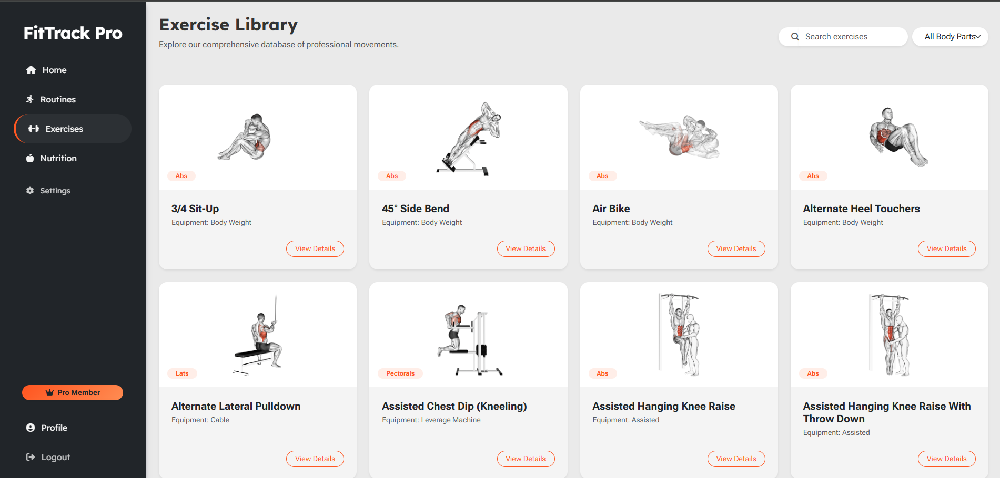
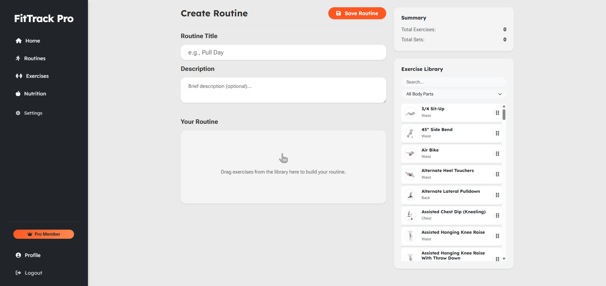
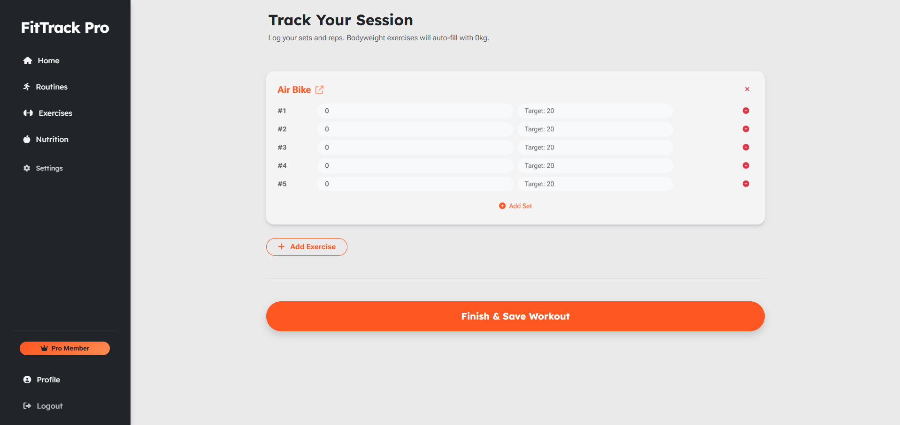
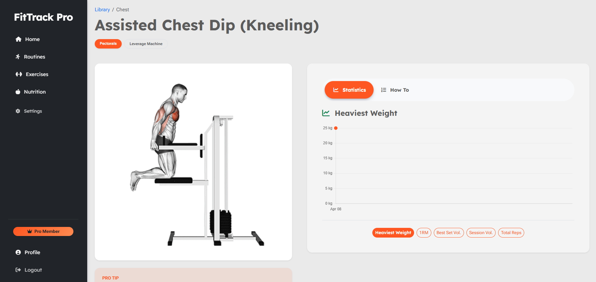
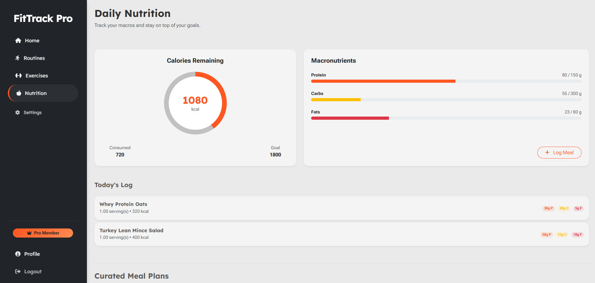
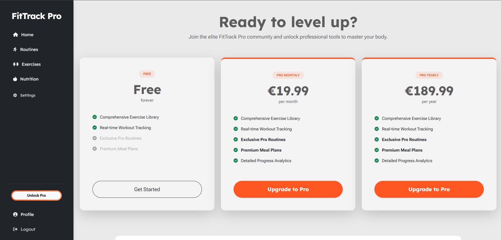
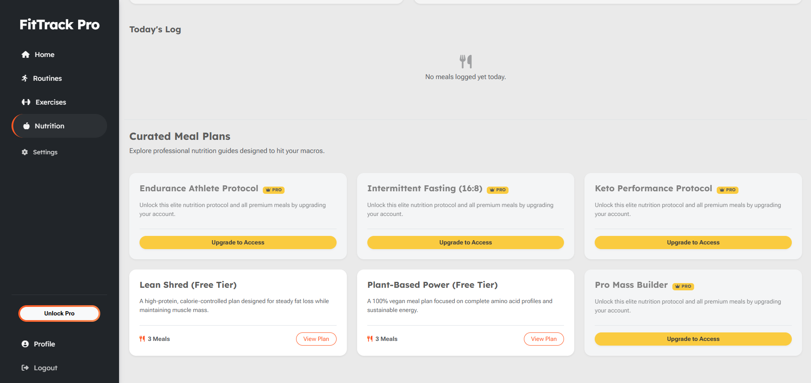

# FitTrack Pro: Premium Fitness Tracking Platform

**Live Demo:** [FitTrack Pro](https://fittrack-pro-48af9670b2de.herokuapp.com/)

**Repository Link:** [github.com/mlucasmichel/FitTrack-Pro](https://github.com/mlucasmichel/FitTrack-Pro)

***

## Table of Contents
1. [**Project Overview**](#1-project-overview)
    * [1.1 Goal & Value Proposition](#11-goal--value-proposition)
    * [1.2 Target Audience](#12-target-audience)
2. [**UX & Design (The 5 Planes)**](#2-ux--design-the-5-planes)
    * [2.1 Strategy & Scope](#21-strategy--scope)
    * [2.2 Structure & Skeleton](#22-structure--skeleton)
    * [2.3 Surface (Design System)](#23-surface-design-system)
3. [**Data Schema (Entity Relationship Diagram)**](#3-data-schema-entity-relationship-diagram)
4. [**Features**](#4-features)
    * [4.1 Core Workout Features](#41-core-workout-features)
    * [4.2 Nutrition & Analytics](#42-nutrition--analytics)
    * [4.3 Monetization & Gating](#43-monetization--gating)
5. [**Testing**](#5-testing)
6. [**Deployment**](#6-deployment)
    * [6.1 Heroku Deployment](#61-heroku-deployment)
    * [6.2 Local Development](#62-local-development)
7. [**Technologies Used**](#7-technologies-used)
8. [**Attribution & Acknowledgements**](#8-attribution--acknowledgements)

***

## 1. Project Overview

### 1.1 Goal & Value Proposition
**FitTrack Pro** is a full-stack web application designed for fitness enthusiasts who want a professional, data-driven approach to their
workout and meal planning.

**The application provides value by:**
* Offering an API-powered library of 100+ professional exercises with GIFs.
* Providing an interactive, real-time workout logger for tracking sets, weight, and reps.
* Delivering premium content and unlimited tracking via a secure Stripe-powered subscription.

### 1.2 Target Audience
Athletes and fitness enthusiasts who require more than just a simple logbook, users who want professional routines, macro tracking, and
visual progress analytics in one cohesive dashboard.

***

## 2. UX & Design

### 2.1 Strategy & Scope
The primary objective was to create a SaaS-style fitness app. The scope focused on combining data API data with user-generated
data to provide immediate feedback via charts.

### 2.2 Structure & Skeleton
The site uses a dual-layout system:
*   **Public:** Split-screen landing pages for high-conversion marketing.
*   **Private:** A persistent sidebar dashboard for focused workout and nutrition management.

**Wireframes:**
| Screen | Description | Mockup Link |
| :--- | :--- | :--- |
| **Home/Login** | Split-screen branding. | [`home-desktop.png`](docs/img/wireframes/home-desktop.png) |
| **Dashboard** | Centralized stats & charts. | [`dashboard-desktop.png`](docs/img/wireframes/dashboard-desktop.png) |
| **Routine Builder**| Drag-and-drop reordering. | [`builder-desktop.png`](docs/img/wireframes/builder-desktop.png) |

### 2.3 Surface (Design System)
*   **Palette:** Primary Orange (`#FF5722`), Deep Grey, and Cream.
*   **Typography:** `Lexend` for headings and `Roboto Flex` for body text.
*   **Components:** Custom cards with floating shadows.

***

## 3. Data Schema (Entity Relationship Diagram)

The application uses a relational structure to manage user progress and subscription status.

| Entity | Description | Key Relationships |
| :--- | :--- | :--- |
| **CustomUser** | Extends `AbstractUser`. | 1:1 with `Subscription` |
| **WorkoutPlan** | Routine templates. | M:N with `Exercise` (via `PlanItem`) |
| **WorkoutLog** | A specific workout session. | 1:N with `SetLog` |
| **MealLog** | Record of daily food intake. | Linked to `User` and `Meal` |


***

## 4. Features

### 4.1 Core Workout Features

* **API-Powered Exercise Library:** 100+ movements synced from ExerciseDB.


* **Interactive Routine Builder:** Drag-and-drop interface for creating custom workouts.


* **Multi-Set Workout Logger:** Real-time tracking of weights and reps.


### 4.2 Nutrition & Analytics

* **Visual Progress Analytics:** 5 dynamic Chart.js metrics (Volume, 1RM, etc.).


* **Daily Calorie Calculator:** Real-time macro tracking ring.


### 4.3 Monetization & Gating

* **Stripe Subscriptions:** Integrated Monthly and Yearly Pro plans.


* **Content Gating:** Dynamic locking of professional plans for Free users.


***

## 5. Testing
Comprehensive testing results, including manual test cases, automated unit tests, and Lighthouse performance audits, are documented here:

[**View TESTING.md**](docs/TESTING.md)

***

## 6. Deployment

The live deployed application can be found on Heroku here: [**FitTrack Pro**](https://fittrack-pro-48af9670b2de.herokuapp.com/).

### 6.1 PostgreSQL Database Setup
This project uses a PostgreSQL database. You must create one before deploying:
1. Log into your preferred PostgreSQL provider (e.g., Code Institute's database maker, Railway, or ElephantSQL).
2. Create a new database instance and copy the **Database URL**.

### 6.2 Heroku Deployment
This project was deployed to Heroku using the following steps:

1. Log into [Heroku](https://www.heroku.com/) and click **"New" -> "Create new app"**.
2. Choose a unique app name, select your region (e.g., Europe), and click **Create app**.
3. Navigate to the **Settings** tab and click **"Reveal Config Vars"**.
4. Add the following environment variables:
    *   `DATABASE_URL`: The URL of your PostgreSQL database.
    *   `SECRET_KEY`: A complex, random string for Django security.
    *   `CLOUDINARY_URL`: Your Cloudinary API environment variable.
    *   `STRIPE_PUBLIC_KEY`: Your Stripe test public key.
    *   `STRIPE_SECRET_KEY`: Your Stripe test secret key.
    *   `STRIPE_WH_SECRET`: Your Stripe webhook secret key.
5. Navigate to the **Deploy** tab.
6. Select **GitHub** as the deployment method and connect your GitHub account.
7. Search for your repository (`FitTrack-Pro`) and click **Connect**.
8. Scroll down to the **Manual deploy** section and click **Deploy Branch** (main).
9. Once the build is complete, click the **"More"** button at the top right of the Heroku dashboard and select
**"Run console"**.
10. Run the following command to build the database schema:
    `python manage.py migrate`
11. Run the following command to create an admin user:
    `python manage.py createsuperuser`

### 6.3 Local Development & Cloning
If you wish to run this project locally, follow these steps:

1. **Clone the repository:** Open your terminal and run:
`git clone https://github.com/mlucasmichel/FitTrack-Pro.git`
2. **Navigate to the directory:**
`cd FitTrack-Pro`
3. **Create a virtual environment:**
`python -m venv .venv`
4. **Activate the virtual environment:**
*   *Windows:* `.venv\Scripts\activate`
*   *Mac/Linux:* `source .venv/bin/activate`
5. **Install dependencies:**
`pip install -r requirements.txt`
6. **Set up Environment Variables:** Create a file named `env.py` in the root directory. Add your credentials:
```
import os
os.environ.setdefault("DATABASE_URL", "your_database_url")
os.environ.setdefault("SECRET_KEY", "your_secret_key")
os.environ.setdefault("CLOUDINARY_URL", "your_cloudinary_url")
os.environ.setdefault("STRIPE_PUBLIC_KEY", "your_stripe_public_key")
os.environ.setdefault("STRIPE_SECRET_KEY", "your_stripe_secret_key")
os.environ.setdefault("STRIPE_WH_SECRET", "your_stripe_webhook_secret")
os.environ.setdefault("RAPIDAPI_KEY", "your_rapidapi_key")
os.environ.setdefault("RAPIDAPI_HOST", "your_rapidapi_host")
os.environ.setdefault("DEVELOPMENT", "True")
```
7. **Migrate the database:**
`python manage.py migrate`
8. **Load Meal Plan Fixtures:**
`python manage.py loaddata meal_plans`
9. **Start the local server:**
`python manage.py runserver`
The application will be available at `http://127.0.0.1:8000/`.

***

## 7. Technologies Used
* **Backend:** Python 3.14 / Django 6.0
* **Frontend:** JavaScript, HTML, CSS, Bootstrap
* **APIs:** Stripe, RapidAPI (ExerciseDB)
* **Hosting:** Heroku, Cloudinary (Media), Whitenoise (Static)

***

## 8. Attribution & Acknowledgements

### External Code Sources
*   **SortableJS:** Drag-and-drop engine for the Routine Builder.
*   **Chart.js:** Logic for interactive progress visualization.
*   **Canvas Confetti:** Success animation on the payment page.
*   **Stripe Webhooks:** Implementation based on official Stripe documentation.

### External Tools
*   **Favicon Generation:** [favicomatic.com](https://favicomatic.com/).
*   **API Mapping Logic:** Inspired by standard Django REST integration patterns.

### Acknowledgements
* Code Institute for providing technical support and the database.
* My family and friends for their feedback and testing.